---
geometry: margin=1in
fontsize: 12pt
header-includes: |
    \usepackage[scaled]{beramono}
    \usepackage{setspace}\doublespacing
    \usepackage{url}
    \usepackage[numbers]{natbib}
    \usepackage{tikz}
    \usetikzlibrary{automata, arrows.meta, positioning}
    \usepackage{listings}
    \usepackage{color}
    \usepackage{xcolor}
    \pagenumbering{gobble}
    \usepackage{float}
    \floatplacement{figure}{H}
title: |
  | {width=2in}
  | \vspace{1cm} \Huge Crowdsourcing EDR measurements using smartphones
  | \vspace{1cm} \large ISSN 2202-0303
author: |
  | Jaan Jaerving \vspace{0.2cm} 
  | Sæmundur Elías Þorsteinsson \vspace{0.2cm} 
  | Helgi Þorbergsson \vspace{4cm}
date: \small \today
...

\definecolor{pblue}{rgb}{0.13,0.13,1}
\definecolor{pgreen}{rgb}{0,0.5,0}
\definecolor{pred}{rgb}{0.9,0,0}
\definecolor{pgrey}{rgb}{0.46,0.45,0.48}
\definecolor{purple}{rgb}{0.65, 0.12, 0.82}

\lstset{language=Java,
  showspaces=false,
  showtabs=false,
  breaklines=true,
  showstringspaces=false,
  breakatwhitespace=true,
  commentstyle=\color{pgreen},
  keywordstyle=\color{pblue},
  stringstyle=\color{pred},
  basicstyle=\ttfamily,
  captionpos=b,                    
  moredelim=[il][\textcolor{pgrey}]{$$},
  moredelim=[is][\textcolor{pgrey}]{\%\%}{\%\%}
}

\pagebreak
\pagenumbering{arabic}

# Table of contents

\ttfamily

* [Acknowledgements ............................................... 5](#acknowledgements)
* [Abstract ....................................................... 6](#abstract)
* 1 [Introduction ................................................. 7](#introduction)
    * 1.1 [What we learned from the previous project .............. 7](#what-we-learned-from-the-previous-project)
    * 1.2 [MQTT .................................................. 10](#mqtt)
    * 1.3 [Storage ............................................... 12](#storage)
* 2 [Android Application ......................................... 13](#android-application)
    * 2.1 [Performance and Stability ............................. 13](#performance-and-stability)
    * 2.2 [Problems with Power Saving ............................ 17](#problems-with-power-saving)
* 3 [Data & Processing ........................................... 19](#data-processing)
    * 3.1 [Latitude & Longitude .................................. 19](#latitude-longitude)
    * 3.2 [Altitude .............................................. 22](#altitude)
    * 3.3 [Speed ................................................. 24](#speed)
    * 3.4 [Acceleration .......................................... 27](#acceleration)
* 4 [Weather Data ................................................ 29](#weather-data)
    * 4.1 [Accessing Observations ................................ 29](#accessing-observations)
    * 4.2 [Interpolation ......................................... 32](#interpolation)
* 5 [Server Implementation ....................................... 36](#server-implementation)
    * 5.1 [Sending Data .......................................... 36](#sending-data)
    * 5.2 [Subscriber Step ....................................... 39](#subscriber-step)
    * 5.3 [Backend & API ......................................... 42](#backend-api)
* 6 [Conclusion .................................................. 43](#conclusion)
* 7 [References .................................................. 44](#references)
* 8 [Appendices .................................................. 45](#appendices)

\pagebreak

# Table of figures

* Figure 1: Comparison of FFT given by the smartphone and PX4 ... 8
* Figure 2: Comparison of filtered acceleration ................. 8
* Figure 3: Original Android application ........................ 9
* Figure 4: Flow diagram for MQTT communication ................ 10
* Figure 5: Flow diagram for MongoDB (three flights on two different days) ......................................................... 13
* Figure 6: Keflavík to Brussels flight path ................... 20
* Figure 7: Brussels to Keflavík flight path ................... 20
* Figure 8: Reykjavík to Egilsstaðir flight path ............... 21
* Figure 9: Reykjavík to Ísafjörður flight path ................ 22
* Figure 10: Keflavík to Brussels flight altitude .............. 23
* Figure 11: Reykjavík to Ísafjörður flight altitude ........... 24
* Figure 12: Keflavík to Brussels flight speed ................. 25
* Figure 13: Reykjavík to Ísafjörður flight speed .............. 26
* Figure 14: Reykjavík to Ísafjörður flight STD/RMS ............ 27
* Figure 15: Reykjavík to Ísafjörður flight EDR ................ 28
* Figure 16: Accelerometer measuring rates ..................... 29
* Figure 17: Weather observations for Blönduós ................. 30
* Figure 18: Weather observations for Austfirðir ............... 31
* Figure 19: Reykjavík to Ísafjörður flight wind speed ......... 35
* Figure 20: Reykjavík to Ísafjörður flight wind direction ..... 36

\pagebreak

# Table of listings

* Listing 1: Sensor event listener ............................. 14
* Listing 2: Measurement object ................................ 14
* Listing 3: Measurement buffer ................................ 16
* Listing 4: Power management .................................. 18
* Listing 5: Choosing a triangle ............................... 32
* Listing 6: Barycentric coordinates ........................... 34
* Listing 7: Measurement dataframe ............................. 37
* Listing 8: Data handler thread ............................... 38
* Listing 9: Subscriber processing ............................. 40
* Listing 10: API routes ....................................... 42

\pagebreak

# List of acronyms

* ACK: Acknowledgment
* API: Application Programming Interface
* EDR: Eddy Dissipation Rate
* FFT: Fast Fourier Transform
* GPS: Global Positioning System
* IP: Internet Protocol
* JSON: JavaScript Object Notation
* MQTT: Message Queueing Telemetry Transport
* OASIS: Open Artwork System Interchange Standard
* PCIe: Peripheral Component Interconnect Express
* PX4: Pixhawk4
* RAM: Random Access Memory 
* RMS: Root Mean Square
* SQL: Structured Query Language
* TCP: Transmission Control Protocol 
* USB: Universal Serial Bus

\pagebreak

\rmfamily

# Acknowledgements

Special thanks to the Student Innovation Fund (Nýsköpunarsjóður námsmanna) for generously funding this report and Kristján Orri Magnússon for providing domestic flight data.

\pagebreak

The project explores the viability of crowd sourcing measurements to map out areas of high turbulence on domestic flight routes in Iceland. Initial viability of measuring vertical acceleration was established in the report preceding this one (ISSN 2772-1078). The objective of the project described in this report is to carry on where the previous project left off, and establish a method to transport data from the measuring smartphone and into a long term storage solution that can then be accessed later for further exploration and processing.

Data communication is provided by a protocol called MQTT. Any smartphone that has measurements to share can publish them to the MQTT broker which then delegates these dataframes to subscriber processes that can do any required postprocessing such as decompression, error correction or even adding weather data. Once the subscriber is done with postprocessing, measurements can be bulk inserted into a database that can be made accessible by providing a user facing API.

\pagebreak

# 1 Introduction

This project continues from the previous one called "Lýðvistun mælinga á ókyrrð í flugi". That previous project made great strides in showing how digital filtering could be used to make use of smartphone sensors to measure EDR. The objective of this project is to continue onwards and set up a viable database system that could be used to store turbulence measurements and other wind phenomena from datacommunications received from smartphones to a central brokering platform. A starting point for this data gathering process was the idea to use the existing 4G connection that smartphones already have in tandem with the MQTT protocol for stable message passing to produce a data pipeline that could be readily received and stored.

These initial goals were implemented successfully, the Eclipse Paho MQTT client library \cite{paho} was used to implement MQTT communications for the Android application. Incoming data was received by a Mosquitto broker and sent onwards to a subscriber program written in NodeJS which would parse the data and store it in a MongoDB database. In addition to this base implementation the subscriber program also makes use of web scraping to retroactively add weather data from the Icelandic Met Office. In order to provide a full demo stack a public facing API as well as a simple frontend web application were also implemented to provide easy access to any collected data. This user accessible portion can be viewed at \url{http://31.209.145.132:3457} and the backend output can be inspected at \url{http://31.209.145.132:3456}.

## 1.1 What we learned from the previous project

### Vertical acceleration, filtering and comparison of measurements

The previous report in this series delves into the viability of measuring vertical acceleration on smartphones, filtering it using stable filter constants and producing EDR values that can be used to assess the turbulence of a given area at a given time. A Samsung Galaxy FE 20 was tested on a vibration motor as well as taken on a test flight to compare with the acceleration values given by a custom made piece of equipment for measuring acceleration called a Pixhawk4 \cite{prev}. The comparison can be seen in Fig. 1.

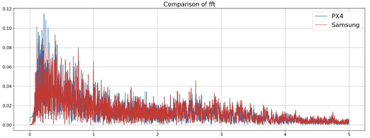{width=100%}

In the previous project a digital filter was designed using Matlab. This yielded filter coefficients that can be used in other programming languages to implement a filter. These filtering coefficients were also compared as can be seen in the following Fig. 2.

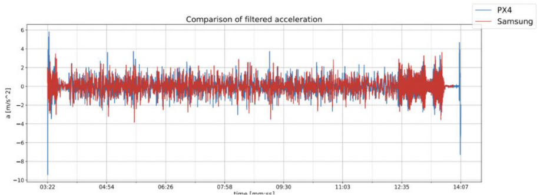{width=100%}

From this we learned that vertical acceleration values given by a phone were very similar in form to the values produced by hardware that was already in use for this kind of purpose.

### Location inaccuracies

In the process of comparing the Samsung smartphone to the PX4 it was also noted that the altitude values provided by the smartphone were not the same as the ones shown by the PX4, in reality the smartphone produced altitude numbers which were 55 m higher in altitude and in comparison to the actual conditions it was possible to observe that the PX4 was closer to the correct number \cite{prev}.

### The Android application

For the purpose of storing and filtering measurements an initial implementation of an Android application was created. For the current project this application provides a solid baseline to build from. The user interface for this initial implementation can be seen here in Fig. 3.

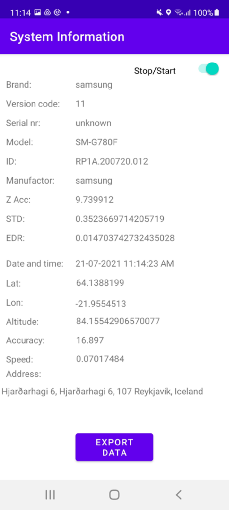{height=40%}

## 1.2 MQTT

The MQTT protocol is an OASIS standard messaging protocol for the Internet of Things. It is designed as an extremely lightweight publish/subscribe messaging transport that is ideal for connecting remote devices with a small code footprint and minimal network bandwidth. This protocol is currently used in a wide variety of industries, such as automotive, manufacturing, telecommunications, oil and gas, etc \cite{mqtt_uses}.

### The publisher, subscriber and broker model

MQTT message passing works by using topics that publishing devices publish to and subscribing devices subscribe to. A broker oversees that information published to a topic is conveyed to the devices that are subscribed to that same topic \cite{mqtt_spec}. For our use case we would be publishing measurement data from our smartphone application to the broker which would forward it to any backend applications that are subscribed to receive that data. There are many different ways to implement this interaction but the one we are interested in is the Paho MQTT client that provides an implementation standard that we can use on both the smartphone application for publishing purposes as well as the receiving computer for subscribing purposes. For our broker we can use an application called Mosquitto which will provide a lightweight, open source implementation of an MQTT broker server. The communication pattern can also be seen in Fig. 4.

\begin{figure}
\begin{center}
\resizebox{0.7\textwidth}{!}{
\begin{tikzpicture} [node distance = 3cm, auto]
 
\node (q0) [rectangle, draw] {Paho 1};
\node (q1) [rectangle, draw, below = of q0] {Paho 2};
\node (q3) [rectangle, draw, right = of q1] {Mosquitto};
\node (q4) [rectangle, draw, right = of q3] {Backend};

\path [-stealth, thick]
    (q0) edge [bend right] node [above right] {$Publish$} (q3)
    (q1) edge node [below] {$Publish$} (q3)
    (q3) edge [bend right] node [below] {$Publish$} (q4)
    (q4) edge [bend right] node [above] {$Subscribe$} (q3);

\end{tikzpicture}
}
\caption{Flow diagram for MQTT communication}
\end{center}
\end{figure}

### Benefits of MQTT/Mosquitto

This kind of message passing implementation provides us several benefits that we do not have to implement ourselves. MQTT implements TCP for its transport layer for additional reliability, this means we can check ACKs on the Android application to see if the broker has received the data we published. The message passing between the three tiers described in Fig. 4 is data agnostic, the broker merely receives a topic and some data represented as bytes. The broker provides initial filtering and validation using our provided topics, it also provides authentication for any connecting clients. Finally this format is easily scalable and components can be replaced or amended without necessarily having to change other components. Publishers, subscribers and topics can be added as needed; modifications can be made to the backend or the Android application without necessarily having an impact on one another and without having to change how the broker is configured \cite{mqtt_spec}.

### Potential downsides

As always when using external code libraries there are some considerations to be made. During early implementation, Android version 12 began its roll-out which had an adverse affect on some of the features of the Paho library, this could be remedied by switching to the unstable version that was still in development but it is an example where third party libraries are not necessarily up to date as soon as a bleeding-edge operating system update rolls out.

Another potential downside of this middle-man format is that the publishing smartphones and the subscribing backend application do not communicate directly, messages could be published to the broker successfully while the backend is not running and the smartphones would not necessarily know anything was amiss. If backend instability is a problem this could potentially be solved by letting the broker store messages that were not successfully subscribed to.

## 1.3 Storage

There are two main storage concerns for this messaging model. Temporary storage on smartphones for messages that are ready but have not yet been sent and permanent storage on the subscribing server for messages that have been received and processed.

### Smartphone storage

The initial variant of the Android application kept all measurements in RAM until they were ready to be exported. This is fine for relatively short test runs but can become a problem when dealing with longer sessions (an hour long session will produce nearly two million rows of measurements) or when we want to do multiple consecutive sessions such as connecting or back to back test flights. What is required then is to periodically write measurements to long term storage and free up RAM. Later, these dataframe files can be read from disk and sent whenever the possibility arises.

### Permanent storage (Database)

For this portion of our tech stack we chose to use NoSQL, MongoDB specifically. Due to the potential of large bulk inserts as well as large deletions following a standard SQL table format becomes problematic. While SQL primary and foreign keys can give us relatively quick select lookups these constraints within a single table also make insertions slower \cite{mongo}.

Since our main use cases do not include updating individual fields or complex joins between tables we decided to adopt a more flexible model. When measurements are stored a table is dynamically created for that specific date. For each date we can have an individual collection for both the values of interest as well as each measuring session that happened on that day. This format allows us to bulk insert with no indexing concerns but allows us to look and export entire sessions without having to explicitly search for values. In essence this is similar to a filing cabinet where each drawer is a date and each folder within a drawer is a specific session. The way this kind of segmenting works could be represented as seen in Fig. 5. 

\pagebreak

\begin{figure}
\begin{center}
\resizebox{0.7\textwidth}{!}{
\begin{tikzpicture} [node distance = 2cm, auto]
 
\node (q0) [rectangle, draw] {MongoDB};
\node (q1) [rectangle, draw, below right = of q0] {10-08-2022};
\node (q2) [rectangle, draw, below left = of q0] {09-08-2022};
\node (q3) [rectangle, draw, below left = of q1] {RKV-EGS};
\node (q4) [rectangle, draw, below = of q1] {AEY-RKV};
\node (q5) [rectangle, draw, below = of q2] {IFJ-AEY};

\path [-stealth, thick]
    (q0) edge node [above right] {$Database$} (q1)
    (q0) edge node [above left] {$Database$} (q2)
    (q1) edge node [above left] {$Collection$} (q3)
    (q1) edge node [right] {$Collection$} (q4)
    (q2) edge node [left] {$Collection$} (q5);

\end{tikzpicture}
}
\caption{Flow diagram for MongoDB (three flights on two different days)}
\end{center}
\end{figure}

# 2 Android Application 

## 2.1 Performance and Stability

Initially some performance adjustments had to be made to the original Android application that can be seen in Fig. 3. There was a suspicion that some select functionality could slow down how quickly the sensor data would be processed. Quickly checking an output file of a demo run done with the original application a simple time/rows calculation gives us that a measurement is only produced at a time interval of approximately `16 ms`. We know that the accelerometer of that specific Samsung phone can measure at a rate of 500 Hz which would ideally produce a measurement every `2 ms`.

To ensure that measurements are produced at the rate the phone is capable of it would be ideal to any kind of longer processing functions, location functions and memory functions to separate threads from the thread that is providing our `onSensorChanged()` event listener. Instead of the main thread function containing all our logic and side functions we now have a relatively compact function that forks the main filter calculations to another handler thread. This implementation can be seen in Listing 1:

\pagebreak

\singlespacing

\begin{lstlisting}[language=Java,caption=Sensor event listener]
public void onSensorChanged(SensorEvent event) {
    if (event.sensor.getType() == Sensor.TYPE_ACCELEROMETER) {
        DateFormat isoDate = new SimpleDateFormat(FileUtils.ISO_DATE);
        isoDate.setTimeZone(TimeZone.getTimeZone("UTC"));
        // Produce timestamp to indicate when measurement was received
        String time = isoDate.format(new Date());
        // Pass vertical acceleration and timestamp to the filter thread
        mMathThread.handleMeasurement(event.values[2], time);
    }
}
\end{lstlisting}

\doublespacing

Removing unnecessary actions such as address lookup and moving filtering and storage calls to their own threads was sufficient to get both our mean and median measuring speed to be close to `2 ms` for the Samsung Galaxy FE20 testing smartphone.

This not sufficient to produce a stable measuring rate however. Initial test runs after dividing our key functions into threads would produce standard deviations between measurements that could reach upwards of `60 ms`. The initial implementation used a single array buffer which was protected by a semaphore to ensure that no race conditions would happen as we wrote our measurements to memory and then later to disk. Each measurement is defined as an object with its relevant fields. The format can be seen here in Listing 2:

\singlespacing

\begin{lstlisting}[language=Java,caption=Measurement object]
public class Measurement implements Cloneable {
    private String time;    // UTC Timestamp
    private float lon;      // Longitude obtained from location
    private float lat;      // Latitude obtained from location
    private float alt;      // Altitude obtained from location
    private float ms;       // Estimated speed obtained from location
    private float ms0;      // Estimated speed obtained by calculation
    private float acc;      // Location accuracy (meters)
    private float z;        // z acceleration value read from the sensor
    private double fz;      // Filter z value result
    private double rms;     // RMS value of the measurement window
    private double edr_rms; // Eddy dissipation rate
    /* Constructors, Getters & Setters */
}
\end{lstlisting}

\doublespacing

This single memory safe single array format had performance issues, though. Every value produced by the sensor would allocate memory for a new measurement object as can be seen in Listing 2. Once a set of measurements would be written to disk the Java garbage collector would go to work to free up the RAM that was previously used by those measurements. Additionally in order to guarantee memory safety this array was protected by a Semaphore (effectively a lock to guarantee that the array can not be written to and read from at the same time). The end result of this frequent memory allocation and collection as well as delays in handing off the lock produced situations where we would end up with unreasonably long gaps in our measurements.

The solution to this problem was to use two preallocated arrays as circular buffers and switch between them instead of locking them. There is a theoretical risk of race conditions if measurement speed severely outpaces the rate at which we can write an array out to disk, but this does not seem to be a valid concern for the measurement rate of any phone we have seen so far. The buffer implementation is shown in Listing 3.

\pagebreak

\singlespacing

\begin{lstlisting}[language=Java,caption=Measurement buffer]
// Assign static memory for both buffers
public static final ArrayList<Measurement> DATA_1 =
  new ArrayList<>(MEASUREMENT_COUNT);
public static final ArrayList<Measurement> DATA_2 =
  new ArrayList<>(MEASUREMENT_COUNT);
// ...
// Swap between arrays according to known index
if (Measurements.sFirstArray) {
    if (Measurements.sCurrIdx >= Measurements.MEASUREMENT_COUNT) {
        flushMessages(true, Measurements.sCurrIdx);
        Measurements.sFirstArray = false;
        Measurements.sCurrIdx = 0;
    }
} else {
    if (Measurements.sCurrIdx >= Measurements.MEASUREMENT_COUNT) {
        flushMessages(false, Measurements.sCurrIdx);
        Measurements.sFirstArray = true;
        Measurements.sCurrIdx = 0;
    }
}
// Obtain memory for Measurement from existing buffer instead of allocating
Measurement m = Measurements.sFirstArray ?
  Measurements.DATA_1.get(Measurements.sCurrIdx) :
  Measurements.DATA_2.get(Measurements.sCurrIdx);
// ...
// Write current filter and measurement values to memory of m
// ...
// Increment index of buffer
Measurements.sCurrIdx++;
\end{lstlisting}

\doublespacing

After lowering our garbage collection footprint by replacing unneeded memory allocation with preallocated static memory we saw the measurement standard deviation drop into the `1 ms` range which is the limit of accuracy provided by the standard Android system clock. If needed it would theoretically be possible to reduce measurement deviation further by running the application under system privileges or by providing a binary written in a language with manual garbage collection. Even with these changes, perfect measurement timing is likely not possible, the core interface for accessing the sensors of the device do not promise perfect accuracy \cite{sensors}.

## 2.2 Problems with Power Saving

There are a number of ways to ensure code execution within an Android application. A brute force approach would be to force the screen to remain on which effectively also forces the processor to remain awake. This carries with it a penalty of severe battery degradation just from keeping the screen on. For the usability of the application it was important to provide a way to measure and send data without having to keep the screen on. Android provides interfaces to write alarm intents, these are not ideal for measuring though as they are intended for longer interval actions such as fetching email.

Realistically what was required was to split measuring and sending into their individual services such that they were not bound to the user interface and would no longer be destroyed when the user interface left the foreground.

Android services come in two flavors, background and foreground. Any service that does not have foreground priority is subject to running its code within the code execution windows provided by the various battery saving features such as doze \cite{doze}.

For continuous measurements and faster sending of data it is imperative that these kinds of battery saving procedures do not interrupt the two main services we described. As such we are effectively left with the option of running our data services with foreground priority with a processor wake-lock as described in \cite{doze}.

Curiously even this is not a silver bullet solution though, certain versions of Android as well as certain vendor implementations of the same version of Android perform battery saving operations differently. 

\pagebreak

In order to cover all bases we effectively need to check a number of conditions as can be seen here in Listing 4:

\singlespacing

\begin{lstlisting}[language=Java,caption=Power management]
if (Build.VERSION.SDK_INT >= Build.VERSION_CODES.M) {
// For Android 6 or newer request permissions to ignore battery optimizations
    if (powerManager.isIgnoringBatteryOptimizations(this.getPackageName())) {
        sensorIntent // If permission to ignore optimizations exist then use it
          .setAction(Settings.ACTION_IGNORE_BATTERY_OPTIMIZATION_SETTINGS);
    } else { // If permission does not exist then request it before using
        sensorIntent
          .setAction(Settings.ACTION_REQUEST_IGNORE_BATTERY_OPTIMIZATIONS);
        sensorIntent
          .setData(Uri.parse("package:" + packageName));
    }
}

// For Android 8 or newer run the service with foreground permissions
if (Build.VERSION.SDK_INT >= Build.VERSION_CODES.O) {
    startForegroundService(sensorIntent);
} else { // For older versions this permission does not exist
    // Resort to running as a background service with screen on
    getWindow().addFlags(WindowManager.LayoutParams.FLAG_KEEP_SCREEN_ON);
    startService(sensorIntent);
}
\end{lstlisting}

\doublespacing

For each individual smartphone, most of this code is unnecessary. Smartphones older than Android 6 do not have aggressive battery saving optimizations, smartphones older than Android 8 cannot run services with foreground processing priority at all.

Even ignoring Android versions the smartphones we tested implemented battery saving features differently, the main testing Galaxy FE20 would run both services just fine simply by requesting foreground, battery optimizations did not have to be ignored even though the Android version indicated that they would be. A OnePlus 10 Pro on the other hand would aggressively remove network permissions from the data sending service despite it being started as a foreground service that requested those permissions. Realistically the only way to be certain that the current solution works for a good subset of devices is to simply test a large number of smartphones.

# 3 Data & Processing

During development testing was actively being done to observe the quality of incoming data. Initial testing to obtain a more consistent measuring rate from the accelerometer sensor was already mentioned in Chapt. 1. Acceleration values are only one part of what needs to be tracked within the smartphone application, however.

## 3.1 Latitude & Longitude 

Raw location data is provided by the smartphone itself in the form of location updates. These are dependent upon available sources, setting the smartphone to airplane mode for example will remove 4G and WiFi triangulation \cite{location}. Even when set to airplane mode and fully reliant on GPS positioning it can be seen below in Fig. 6. That consistent location values can still be obtained and used to plot an accurate flight path, even for international flights.

\begin{figure}
  \centering
  \includegraphics[height=6.50cm]{brussels1_path.png}
  \includegraphics[height=6.50cm]{brussels1_coords.png}
  \caption{Keflavík to Brussels flight path}
\end{figure}

There are some caveats to obtaining location using a smartphone in this way. On a separate international flight we could see the path produced in the following Fig. 7.

\begin{figure}
  \centering
  \includegraphics[height=6.48cm]{brussels2_path.png}
  \includegraphics[height=6.48cm]{brussels2_coords.png}
  \caption{Brussels to Keflavík flight path}
\end{figure}

For this flight a window seat could not be obtained and the smartphone did not have good line of sight of the sky. Due to this handicap location values were not produced continuously, instead they appear as a sudden change when the smartphone briefly obtains a new location value. This indicates that in order to be able to use the application to mark areas of interest a good line of sight of the sky is required. We can see that this also holds for domestic flights by observing Fig. 8.

\begin{figure}
  \centering
  \includegraphics[width=15cm]{egs_path.png}
  \includegraphics[width=15cm]{egs_coords.png}
  \caption{Reykjavík to Egilsstaðir flight path}
\end{figure}

\pagebreak

Unlike the international flights that could be seen in Fig. 6 and Fig. 7 the flight in Fig. 8 was taken by the pilot, in that particular instance the smartphone was placed low in the cockpit. An additional test was made later where the smartphone was placed on top of the dashboard and the results of that flight can be seen here in Fig. 9.

\begin{figure}
  \centering
  \includegraphics[height=7.59cm]{isaf_path.png}
  \includegraphics[height=7.59cm]{isaf_coords.png}
  \caption{Reykjavík to Ísafjörður flight path}
\end{figure}

Once again with sufficient line of sight of the sky the smartphone is able to produce continuous location updates and it becomes possible to plot out a much more accurate flight path.

## 3.2 Altitude 

Altitude is also given by the location data of the device but this value comes with additional caveats. For every reported set of location values a GPS accuracy is given, this is an estimated horizontal accuracy in meters of the given location at the 68th percentile confidence level. It is explicitly noted that this GPS accuracy value makes no guarantees for vertical positioning \cite{location}. As a result even when longitude and latitude appear to be continuous we do not necessarily see this for altitude. If we look at the altitude plots in the following Fig. 10 and Fig. 11, representing the altitude for our international and domestic flights with good location data, we see that the altitude values we receive are not correct for the entire duration of the flight.

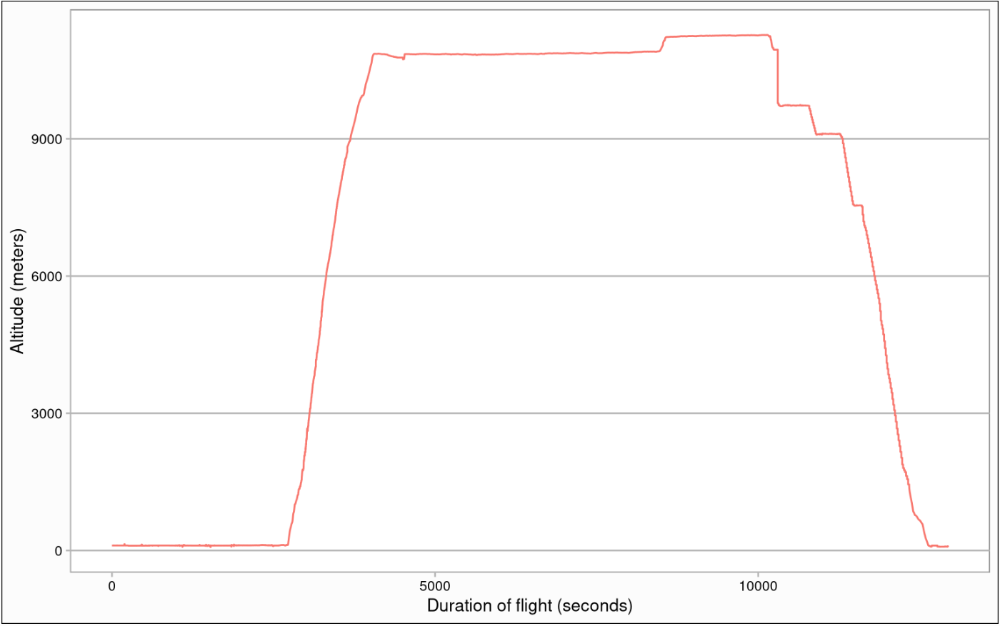{width=100%}

For the above Fig. 10 sharp changes in altitude can be seen and it is likely that the change should have been more gradual in reality.

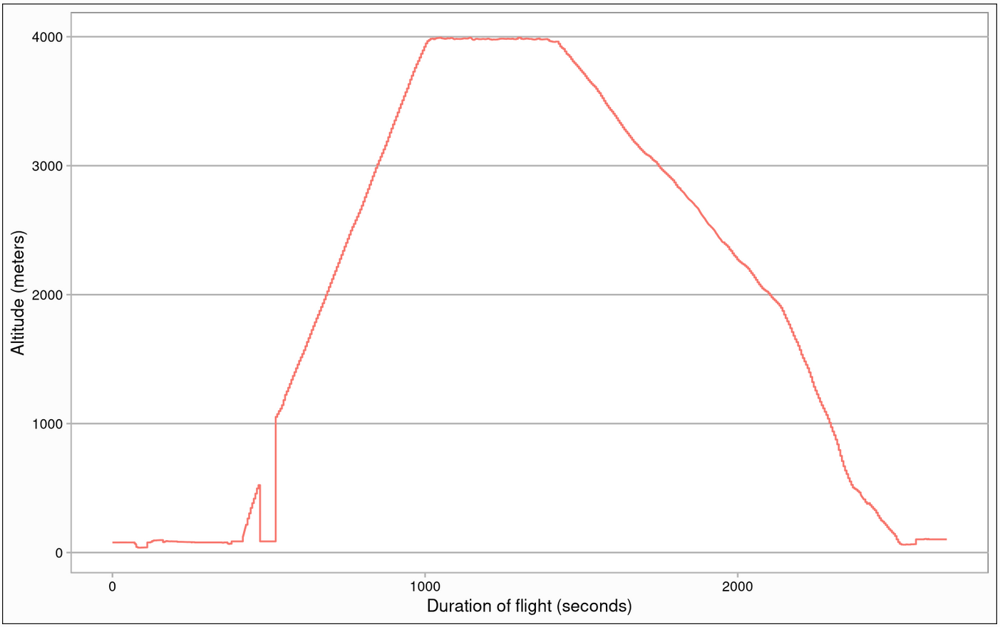{width=100%}

For this domestic flight in Fig. 11 more gradual changes in altitude can be seen overall but obviously wrong values at around the 500th second of the flight where the altitude suddenly spikes back down to ground levels. It is also worth remembering that in \cite{prev} there appeared to be a difference in stable ground altitude between values produced by the smartphone and values produced by the PX4.

## 3.3 Speed

Travel speed values also had to be given special consideration. The formula for a given EDR value is as follows.

$$EDR = \frac{\sigma_{\ddot{z}}}{\sqrt{0.7 \cdot v^{\frac{2}{3}} \cdot I}}$$

A more in depth explanation can be seen in \cite{prev} but for this specific chapter we are mostly concerned with the variable for air velocity *v*. Since *v* is part of the divisor, fluctuations in velocity similar to the ones seen in altitude can end up producing what could be considered false positives when it comes to EDR. And indeed a fluctuation similar to the one visible in Fig. 11 is visible when observing speed values produced by the smartphone. We can see an example of this in Fig. 12 here:

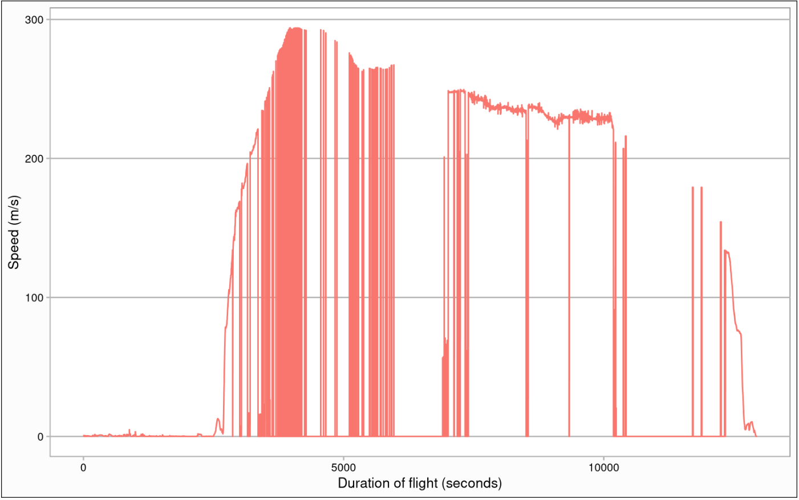{width=100%}

Any of these artificial valleys would produce extremely high EDR values due to a part of the divisor, *v* specifically, being 0 or near 0. After this was observed an effort was made to find an alternative way to obtain values for velocity and example output for the solution that was arrived at can be seen in the upcoming Fig. 13.

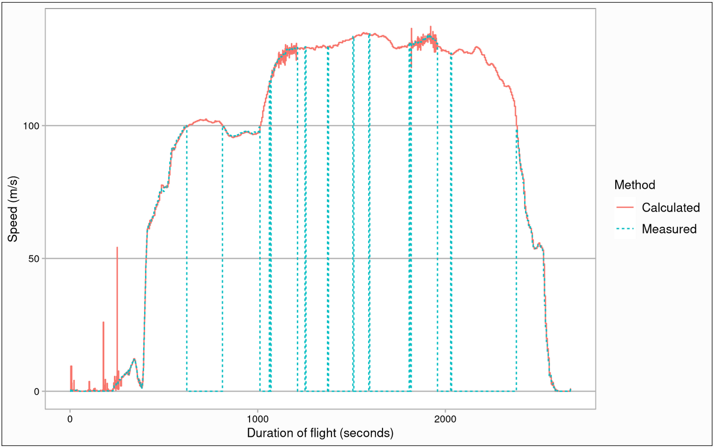{width=100%}

Even though speed values may have severe errors as can be seen in Fig. 12 the same flight is very likely to have correct longitude and latitude data as can be seen in Fig. 6, the coordinate track for that same flight. In a private conversation concerning the viability of the Hvassahraun airport Dr. Þorgeir Pálsson suggested that it should be viable to use speed calculated from distance instead of the raw speed value produced by the smartphone. It stands to reason that it is possible to calculate the distance using the haversine formula for distance between two points on a sphere. These calculations are what appear in Fig. 13 as the red calculated track and are the values used for *v* in the current version of the smartphone application.

## 3.4 Acceleration

Some changes were also made to vertical acceleration. The initial version of the formula visible in Chapt. 3.3 uses standard deviation. In another conversation about the Hvassahraun airport it was noted by Dr. Gylfi Árnason that the final EDR value should likely use root mean square instead of standard deviation. To ensure correctness this was implemented and as a result the formula in use by the smartphone app currently is:

$$EDR = \frac{RMS_{\ddot{z}}}{\sqrt{0.7 \cdot v^{\frac{2}{3}} \cdot I}}$$

A comparison of the two methods can be seen in Fig. 14 shown below:

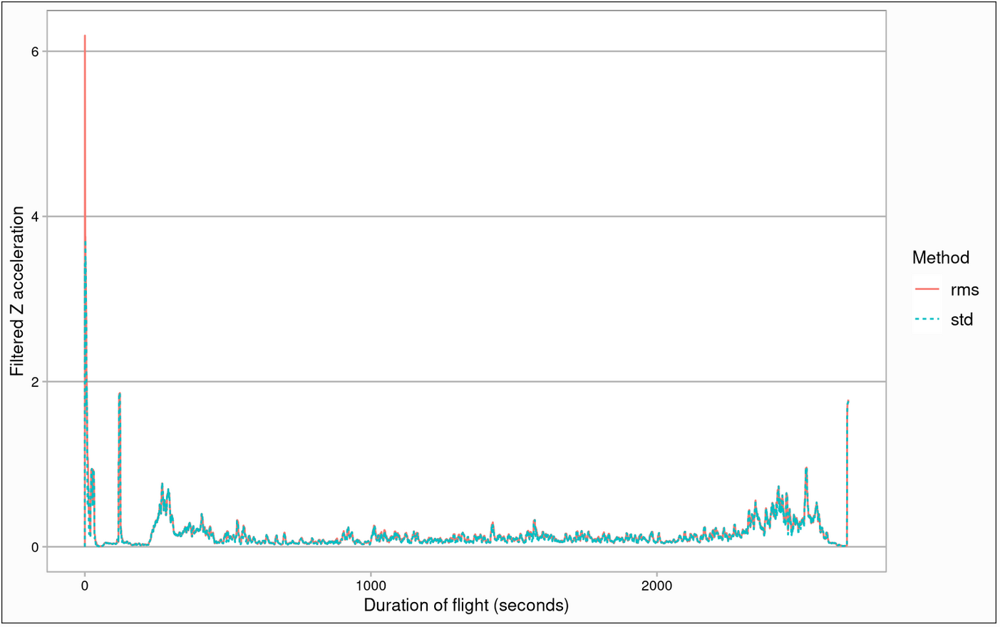{width=100%}

For standard test flights this change does not produce a significant difference in the EDR values produced. Some difference in the peaks can be seen at extremely low speeds but these values are unlikely to be significant due to the scaling effect low speed has on the divisor. An EDR track can also be drawn up for this flight using the speed values and RMS output we have seen previously, that track can be seen in the upcoming Fig. 15. In that figure it can be seen that values produced before takeoff and after landing will produce extremely large EDR values due to the drop in speed, it would therefore likely be useful to implement a minimum speed requirement for noteworthy measurements.

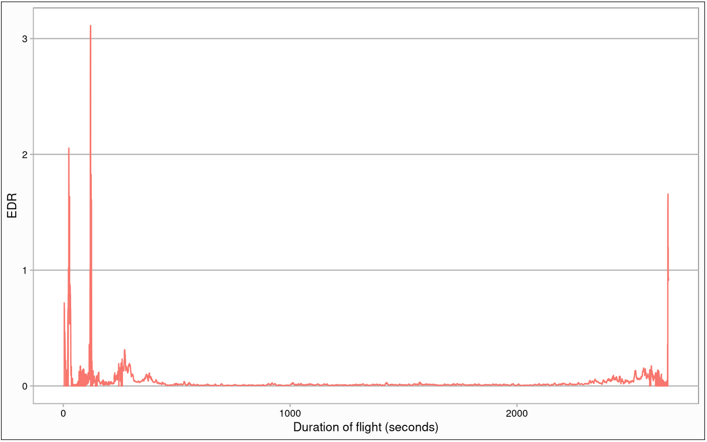{width=100%}

It is also worth considering that the digital filter coefficients produced in the previous report were made with a 500 Hz measuring rate in mind \cite{prev}. This is not really a rate that can be assumed for all phones, in reality we can observe a number of different measuring rates as can be seen in Fig. 16.

\begin{figure}
\begin{center}
\begin{tabular}{ |l|c| }
 \hline
 Smartphone model & Measuring rate (Hz) \\ 
 \hline\hline
 iPhone Xs Max & 100 \\
 OnePlus 10 Pro & 506 \\
 OnePlus Nord & 400 \\
 Google Pixel 5 & 423 \\
 Google Pixel 6 Pro & 440 \\
 Samsung Galaxy A70 & 200 \\
 Samsung Galaxy FE20 & 500 \\ 
 Samsung Galaxy S22+ & 500 \\  
 \hline
\end{tabular}
\caption{Accelerometer measuring rate of different smartphones}
\end{center}
\end{figure}

The values in the above figure are obtained by measuring sampling rate using Phyphox \cite{phyphox} and also by checking frequency of measurements on volunteer data. For the sake of correctness it is likely that additional filter coefficients should be implemented and chosen between in order to accommodate a wider range of devices.

# 4 Weather Data

## 4.1 Accessing Observations

Matching weather data to location data was more problematic than expected. Predictive data is much more readily available through various APIs, most of which are paid services that do not reveal the models used to obtain values at a given location. Measured historical observations are slightly more difficult to get in a reasonable way. Most weather APIs do not actually provide any way to directly query stations and likely do not even have any but aggregate from some initial source. These kinds of observations are readily available to view on the weather website of the Icelandic Met Office but there is not a sufficiently capable public facing API - one exists but it seems to only provide most recent measurements for ground observations. As such for the purposes of an initial version the decision was made to scrape the observations that can be viewed directly on the site. An example of the observations available for a ground station can be seen in the following Fig. 17.

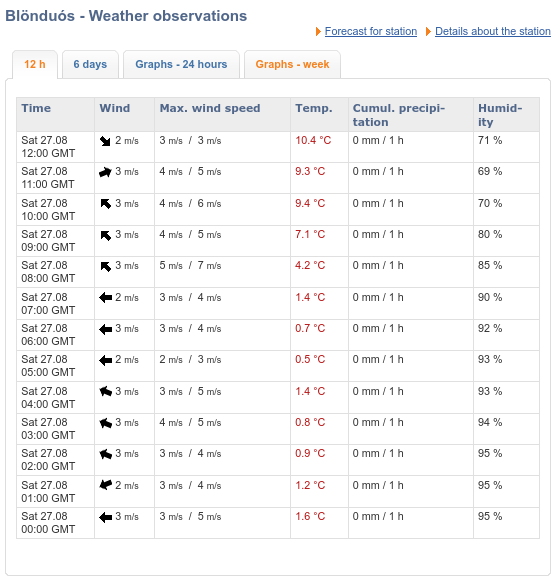{width=100%}

This kind of table can be queried for a number of locations throughout Iceland and generally there are around 30 stations that respond with wind data that would be relevant. While the maximum storage period of 6 days is quite comfortable to use, the number of stations is not really sufficient to provide observations at a specific location. The site also provides observations for flight weather which uses significantly more stations, around 250 that actively respond specifically. An example of a table of observations provided by such a station can be seen in the upcoming Fig. 18.

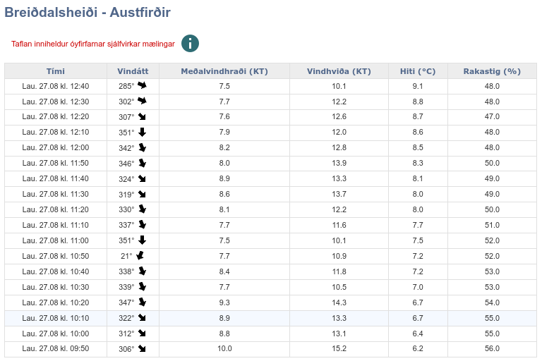{width=100%}

The potential accuracy for these observations is much more suitable, observations are provided at 10 minute intervals and reporting stations are spaced much more tightly throughout the country. The downside of this alternative is that at any one moment data is only available for 4 hours. This downside can be quite easily mitigated by automatically scraping every 4 hours and storing the relevant data locally, and this is the route that was chosen. Flight weather observations are scraped on a schedule and stored locally in a simple SQLlite database. This database can then be queried for periods longer than 4 hours into the past. Ground station observations can be used for a fallback if it becomes necessary to query more than 4 hours into the past but the database does not return anything relevant.

## 4.2 Interpolation

Even though the so-called flight weather observation stations are relatively tightly spaced throughout the country they do still not provide point accuracy for any given location. To try mitigate over-estimation by using only one adjacent station a very simple model was implemented to choose the best matching triangle that contains the location we want and interpolate within that triangle. Choosing the triangle itself is relatively simple, viable stations are sorted in order of distance from the location in question and then checked in sets of three to see if a triangle of those three points would contain the location we are interested in. A code implementation can be seen here in Listing 5.

\lstdefinelanguage{JavaScript}{
  keywords = {typeof, new, true, false, function, return, null, switch, var, if, in, while, do, else, case, break, class, export, boolean, throw, implements, import, this, constructor, string, number, public, private, static, const, var, let, void},
  morekeywords = [2]{class, export, boolean, throw, implements, import, this, interface},
  morekeywords = [3]{Promise, Observable},
  morekeywords = [4]{log},
  otherkeywords = {;},
  comment = [l]{//},
  morecomment = [s]{/*}{*/},
  morestring = [b]',
  morestring = [b]",
}

\lstset{
  language= JavaScript,
  sensitive = false,
  breaklines = true,
  showstringspaces= false,
  showspaces= false,
  extendedchars= true
}

\singlespacing

\begin{lstlisting}[language=JavaScript,caption=Choosing a triangle]
stations.sort(compareStation); // Order stations by distance
for (let i = 0; i < stations.length - 2; i += 1) {
  if (blacklist.includes(stations[i].id)) continue;
  for (let j = i + 1; j < stations.length - 1; j += 1) {
    if (blacklist.includes(stations[j].id)) continue;
    for (let k = j + 1; k < stations.length; k += 1) {
      if (blacklist.includes(stations[k].id)) continue;
      if (inTriangle( // Check whether point is in triangle
          [lat, lon],
          [[stations[i].lat, stations[i].lon], [stations[j].lat, stations[j].lon], [stations[k].lat, stations[k].lon]]
        )
      )
      return [stations[i], stations[j], stations[k]];
    }
  }
}
\end{lstlisting}

\doublespacing

\pagebreak

For the three stations we then have to consider the weight to give to their weather measurements. A simple way to do this would be to check their individual distance from our point of interest, but this can produce rather warped values for triangles which are not equilateral. Instead we can use a method that is popular in computer graphics and use barycentric coordinates which effectively provide weights based on area instead of distance.

Weights for the individual stations, represented as points *A, B* and *C* can be represented as the following area definitions (where *P* is our location point of interest):

$$u = \frac{TriangleCAP_{Area}}{TriangleABC_{Area}}$$
$$v = \frac{TriangleABP_{Area}}{TriangleABC_{Area}}$$
$$w = \frac{TriangleBCP_{Area}}{TriangleABC_{Area}}$$

The total area of *u + v + w* is always 1 as it is the total area of the triangle and the individual values should therefore be in the range of 0 to 1. We can represent this in code with our point of interest and triangle points as follows in Listing 6.

\singlespacing

\pagebreak

\begin{lstlisting}[language=JavaScript,caption=Barycentric coordinates]
export function baryCentricWeights(point, triangle) {
  const cx = point[0],
    cy = point[1],
    t0 = triangle[0],
    t1 = triangle[1],
    t2 = triangle[2];

  const u =
    ((t1[1] - t2[1]) * (cx - t2[0]) + (t2[0] - t1[0]) * (cy - t2[1])) /
    ((t1[1] - t2[1]) * (t0[0] - t2[0]) + (t2[0] - t1[0]) * (t0[1] - t2[1]));

  const v =
    ((t2[1] - t0[1]) * (cx - t2[0]) + (t0[0] - t2[0]) * (cy - t2[1])) /
    ((t1[1] - t2[1]) * (t0[0] - t2[0]) + (t2[0] - t1[0]) * (t0[1] - t2[1]));

  const w = 1 - u - v; // Since it is known the total area is one we can take the difference

  return [u, v, w];
}
\end{lstlisting}

\doublespacing

The final result of using this combination of scraped direct weather observations and triangular interpolation applied to each set of measurements that comes in from the smartphone application produces weather data that can be seen in the following Figures 19 and 20.

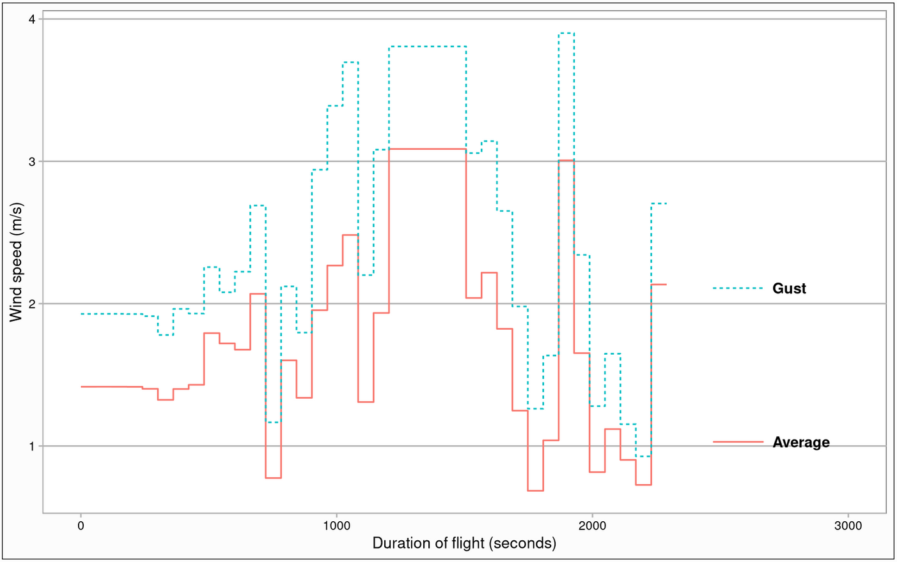{width=100%}

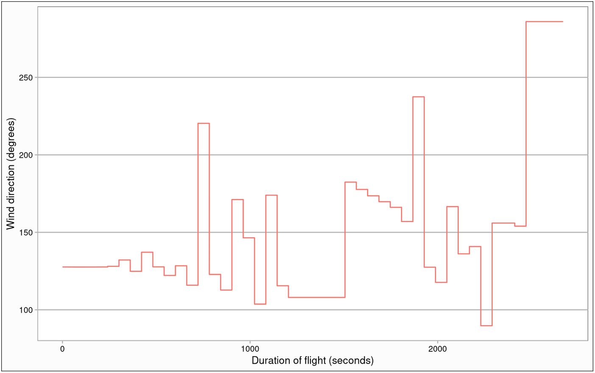{width=100%}

These are values from one of the later domestic flights we discussed in Chapt. 3. As we can see this is not a perfect implementation, we can see in Fig. 19 for example that the stations chosen at around 2500 seconds did not have wind speed values but they did have direction. The ideal way to implement this would be in close cooperation with the Icelandic Met Office.

# 5 Server Implementation

## 5.1 Sending Data

In Fig. 4 there was a simple definition of the data pipeline using MQTT. In this chapter we will discuss how the initial measurement data travels through this pipeline in more depth.

\lstset{language=Java,
  showspaces=false,
  showtabs=false,
  breaklines=true,
  showstringspaces=false,
  breakatwhitespace=true,
  commentstyle=\color{pgreen},
  keywordstyle=\color{pblue},
  stringstyle=\color{pred},
  basicstyle=\ttfamily,
  captionpos=b,                    
  moredelim=[il][\textcolor{pgrey}]{$$},
  moredelim=[is][\textcolor{pgrey}]{\%\%}{\%\%}
}

The definition for each message passed through MQTT is described by the following code in Listing 7:

\singlespacing

\begin{lstlisting}[language=Java,caption=Measurement dataframe]
public class Dataframe implements Serializable {
    private String brand; // Brand of the smartphone
    private String manufacturer; // Manufacturer of the smartphone
    private String model; // Model number of the smartphone
    private String id; // Unique device identifier 
    private String version; // Android version being run
    private String session; // User described name for measurement session 
    private String start; // Starting time for measuring session
    private List<Measurement> data; // List of individual measurements, max 30000
    /* Constructors, Getters & Setters */
}
\end{lstlisting}

\doublespacing

In effect each of these so-called dataframes contains single lines used to define the measuring device and a set of 1 to 30000 measurements, the definition for an individual measurement was defined in Listing 2. When our measuring buffer hits the defined limit of 30000 measurements we switch buffers and write the filled dataframe to disk in zipped format.

Once the users of the smartphone application decide they have finished measuring, they then have the option to begin sending these stored dataframes. The main function loop for sending individual dataframes can be seen here in Listing 8:

\pagebreak

\singlespacing

\begin{lstlisting}[language=Java,caption=Data handler thread]
mBacklogHandler.post(new Runnable() { // Handler thread for these tasks
    @Override
    public void run() { // Definition of task to run
        // Obtain list of stored dataframe files
        ArrayList<String> files = FileUtils.list(getApplicationContext());
        // If there are no files then stop looping
        if (files.size() == 0) {
            mBacklogHandler.postDelayed(() -> stopSelf(), Mqtt.TIMEOUT * 2);
        } else { // If there are any files proceed to check connection
            if (mPublisher != null && mPublisher.isConnected()) {
                Measurements.sBacklogHasConnection = mPublisher.isConnected();
                // If there is a connection then send the file
                if (mMessageThread != null) {
                    mMessageThread.handleFile(files.get(0), mPublisher, getApplicationContext());
                } // If there isn't a connection try request one
            } else if (mPublisher != null && !mPublisher.isConnected() && NetworkUtils.isNetworkAvailable((Application) getApplicationContext()))
                Mqtt.connect(mPublisher, getString(R.string.mqtt_username), getString(R.string.mqtt_password));

            // Post the same task to be run after a delay
            mBacklogHandler.postDelayed(this, mPublisher != null && mPublisher.isConnected() ? Mqtt.TIMEOUT : Mqtt.TIMEOUT * 2);
        }
    }
});
\end{lstlisting}

\doublespacing

These dataframes are sent to the MQTT broker mentioned previously, the broker sends back an acknowledgement upon receiving such a dataframe and once that acknowledgement arrives to the smartphone the backlogged file is deleted.

At the other end of this interaction the broker will publish that same zipped data to a predefined topic. This data is then picked up by a MQTT subscriber and processed.

## 5.2 Subscriber Step

\lstset{
  language= JavaScript,
  sensitive = false,
  breaklines = true,
  showstringspaces= false,
  showspaces= false,
  extendedchars= true
}

The MQTT subscriber program is set up to listen to the predefined topic, receive data for that topic and to do the initial processing work and validation for data received. Most of these steps are quite simple. Initially when the MQTT broker sends a dataframe it must be decompressed using gzip. Once this is done it is possible to rely on the fact that the dataframes are sent as serialized JSON, therefore a valid dataframe should also be able to be read as a JSON object. Once this JSON object has been unzipped and parsed it is important to flatten the data such that the identifying device information that is only represented once per dataframe is injected back into every measurement, this process ensures that each row provides a complete record of a measurement. During this kind of row-wise manipulation there is also the opportunity to add additional data and this opportunity is used to add weather data for each row using the methods described in the previous Chapt. 4. It is also possible to use this initial loop to do some initial inspection, one of the methods implemented is to find observations of interest that show high EDR values. The complete processing loop can be seen here in the upcoming Listing 9:

\pagebreak

\singlespacing

\begin{lstlisting}[language=JavaScript,caption=Subscriber processing]
async function resolve(msg) {
  let message;
  try {
    message = JSON.parse(msg);
  } catch (err) {
    logger.error('Unable to parse msg', err.stack);
    return;
  }

  if (!message) return; // Not valid JSON 

  const { start, brand, manufacturer, model, id, version, session, data } = message;

  if (!data) return; // No measurement data

  let windAvg = '';
  let windMax = '';
  let windDir = '';
  let windMethod = '';
  let windSource = '';

  try { // Add in wind data
    const mid = data[Math.floor(data.length / 2)];
    const windData = await search(mid.lat, mid.lon, mid.time);
    if (Object.keys(windData).length > 0) {
      windAvg = windData.windAvg;
      windMax = windData.windMax;
      windDir = windData.windDir;
      windMethod = windData.method;
      windSource = windData.source;
    }
  } catch {
    console.error(err);
  }

  let anomaly;
  let highest = 0.25;

  // Construct identifier string
  const s = `${start}_${id}_${session}`;

  // Unroll user information back into every measurement, check for highest edr value
  data.forEach((obj) => {
    obj.brand = brand;
    obj.manufacturer = manufacturer;
    obj.model = model;
    obj.id = id;
    obj.version = version;
    obj.session = s;
    obj.windAvg = windAvg;
    obj.windMax = windMax;
    obj.windDir = windDir;
    obj.windMethod = windMethod;
    obj.windSource = windSource;

    if (obj.edr > highest) {
      anomaly = obj;
      highest = obj.edr;
    }
  });

  // Send in processed measurement data to be inserted into MongoDB
  await insert(start, s, data, anomaly).catch((err) => {
    console.error(err);
    logger.error('Unable to insert to MongoDB', err.stack);
  });
}
\end{lstlisting}

\doublespacing

Once this processing step completes these measurements are inserted into a MongoDB database in a manner similar to the one described in Fig. 5. Aside from writing to the same database used by the backend there is actually no direct code sharing between the subscriber code and the rest of the backend code, because of this the steps are relatively modular and can be changed individually without many issues. Due to JavaScript being weakly typed it is still possible to retain the ability to deal with data in an agnostic way at this step, there are some expectations towards the identifying variables of the smartphone being present but individual measurement variables can be changed at the Android application level without impacting this processing step.

\pagebreak

## 5.3 Backend & API

The general research question of transporting crowdsourced EDR measurement data to a central storage database has been covered in the previous chapters. As an extension to this core implementation it seemed obvious to add a way to interact with the gathered data. For this purpose a simple backend process was also implemented. This is a NodeJS backend with a couple of routes that are provided as an API accessible to the public. The specific routes are visible here in Listing 10:

\singlespacing

\begin{lstlisting}[language=JavaScript,caption=API routes]
// Route to download latest Android APK
router.get('/app', sendApk); 
// Route to get a list of days that have measurements stored (Databases)
router.get('/days', validationCheck, catchErrors(listDays)); 
// Route to fetch the sessions for one specific day (Collections)
router.get(
  '/days/:dayId',
  dayIdValidator,         //
  validationCheck,        // Request validation and error handling
  catchErrors(listDay)    //
);
// Route to fetch a representative path sample for a given session
router.get(
  '/days/:dayId/sessions/:sessionId/sample',
  dayIdValidator,             //  
  sessionIdValidator,         // Request validation and error handling
  validationCheck,            //
  catchErrors(sampleSession)  //
);
// Route to download a complete csv for a given session
router.get(
  '/days/:dayId/sessions/:sessionId/csv',
  dayIdValidator,           //
  sessionIdValidator,       // Request validation and error handling
  validationCheck,          //
  catchErrors(csvSession)   //
);
\end{lstlisting}

\doublespacing

\pagebreak

Effectively this provides a simple way to inspect the stored data in the model it is stored (See Fig. 5). Here sessions represent individual flights which are stored in their own collection and days represent databases which can contain a number of these collections. In addition to providing access to data it also provides a way to download the newest version of the Android app through the `/app` route - this is effectively just a download link that can be used by those who want to provide measurement data.

### The website

A very simple website has been implemented as a graphical way to interact with this user interface. This site can be accessed at \url{http://31.209.145.132:3457} (intended for use on desktop) and grants access to some of the later testing data.

# 6 Conclusion

As shown in the previous chapters the process of crowdsourcing EDR measurements to a research database is a viable process. Something akin to a minimal viable product has been produced for the purpose of a tech demo to support this report. An Android application is provided that can theoretically be run on any Android smartphone and the process of gathering measurements is relatively simple, albeit with some positioning requirements in order to ensure line-of-sight of the sky. It is also important to keep in mind, however, that in order to scale up this project more care must be taken when it comes to different smartphone models. We saw in Fig. 16 that the measuring rate of different models of smartphone is not necessarily identical and it is possible that an addition to the Android app is required to change between filter coefficients. It would also be necessary to implement the last part of the divisor for the EDR formula, the variable *I* which refers to the aerial properties of the airplane, this would not be particularly difficult to implement once a reasonable set of values exist, and could even be looped in to automatically update by adding a route to the backend.

Thus far the entire processing and backend application stack has been running on a Raspberry Pi4. While this has proved to be an effective and simple way of testing the different components required to make the entire process work it has also removed the ability to effectively load test the current solution. The MongoDB database has been running off of a USB thumb drive which presents challenges when it comes to any kind of read/write operations. For the purposes of continuing on with this project it would be wise to move all the data processing operations to a more suitable host device which could provide at least PCIe storage and, hopefully, a static IP address.

# 7 References 

<!-- \bibitem{lamport94}
  Leslie Lamport,
  \textit{\LaTeX: a document preparation system},
  Addison Wesley, Massachusetts,
  2nd edition,
  1994. -->

<!-- For mongo: https://sci-hub.se/10.1016/j.matpr.2020.03.634 -->

\bibliographystyle{IEEEtran}
\renewcommand{\bibsection}{}
\begin{thebibliography}{9}

\bibitem{prev} R. E. Garðarsdóttir and S. E. Þorsteinsson, 2021, "Lýðvistun mælinga á ókyrrð í flugi," University of Iceland, ISSN 2772-1078, nr. 100

\bibitem{paho} Eclipse Foundation, "Eclipse Paho Android Service," \textit{eclipse.org}, 2022. [Online]. Available: \url{https://developer.android.com/guide/topics/sensors/sensors_motion}. [Accessed: Aug. 19, 2022].

\bibitem{mqtt_uses} ``MQTT Use Cases,`` \textit{mqtt.org}, 2022. [Online]. Available: \url{https://mqtt.org/use-cases}. [Accessed: Aug. 15, 2022].

\bibitem{mqtt_spec} IBM and Eurotech, "MQTT V3.1 Protocol Specification," 2022. [Online]. Available: \url{https://public.dhe.ibm.com/software/dw/webservices/ws-mqtt/mqtt-v3r1.html}. [Accessed: Aug. 15, 2022].

\bibitem{mongo} B. Jose and S. Abraham, "Performance analysis of NoSQL and relational databases with MongoDB and MySQL," \textit{Materials Today: Proceedings}, vol. 24, no. 3, pp. 2036-2043, March 2020. [Online]. Available: \url{https://doi.org/10.1016/j.matpr.2020.03.634}. [Accessed: Aug. 15, 2022].

\pagebreak

\bibitem{sensors} Google Developers, "Motion sensors," \textit{developer.android.com}, 2022. [Online]. Available: \url{https://developer.android.com/guide/topics/sensors/sensors_motion}. [Accessed: Aug. 16, 2022].

\bibitem{doze} Google Developers, "Optimize for Doze and App Standby," \textit{developer.android.com}, 2022. [Online]. Available: \url{https://developer.android.com/training/monitoring-device-state/doze-standby}. [Accessed: Aug. 16, 2022].

\bibitem{location} Google Developers, "Location," \textit{developer.android.com}, 2022. [Online]. Available: \url{https://developer.android.com/reference/android/location/Location}. [Accessed: Aug. 22, 2022].

\bibitem{phyphox} S. Staacks, S. Hütz, H. Heinke and C. Stampfer, "Advanced tools for smartphone+based experiments: Phyphox," \textit{Phys. Educ. 53 045009}, pp. 1-6, 2018.

\end{thebibliography}

# 8 Appendices

**All source code is available at the following links:**

* Android application: \url{https://github.com/anjrv/edr_app}
* MQTT subscriber: \url{https://github.com/anjrv/edr_subscriber} 
* Backend API: \url{https://github.com/anjrv/edr_backend}
* Weather scraper: \url{https://github.com/anjrv/vedur}
* Frontend demo: \url{https://github.com/anjrv/edr_frontend}

